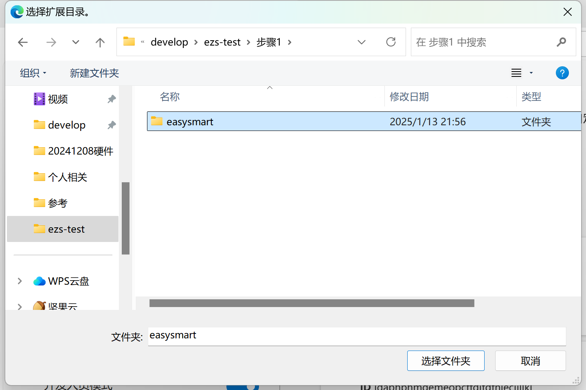
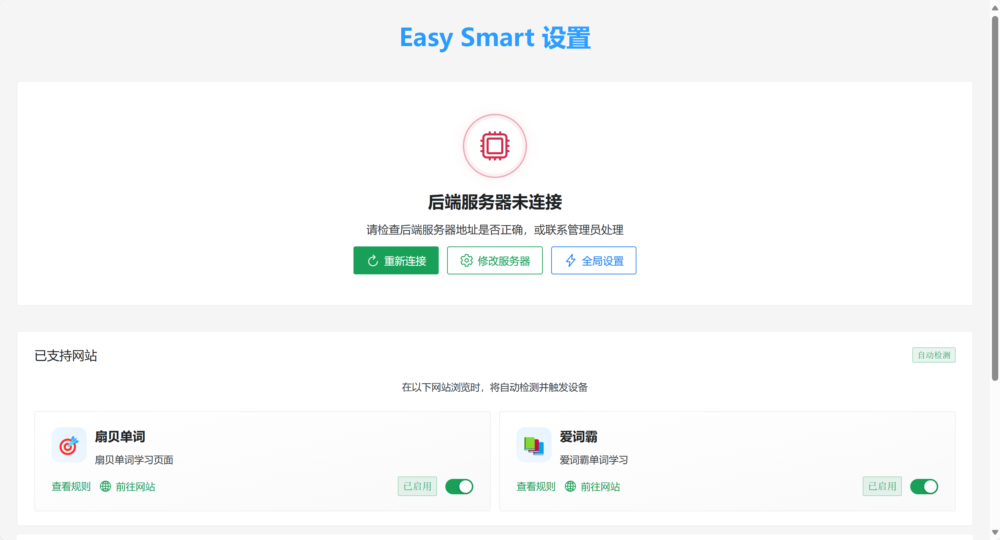
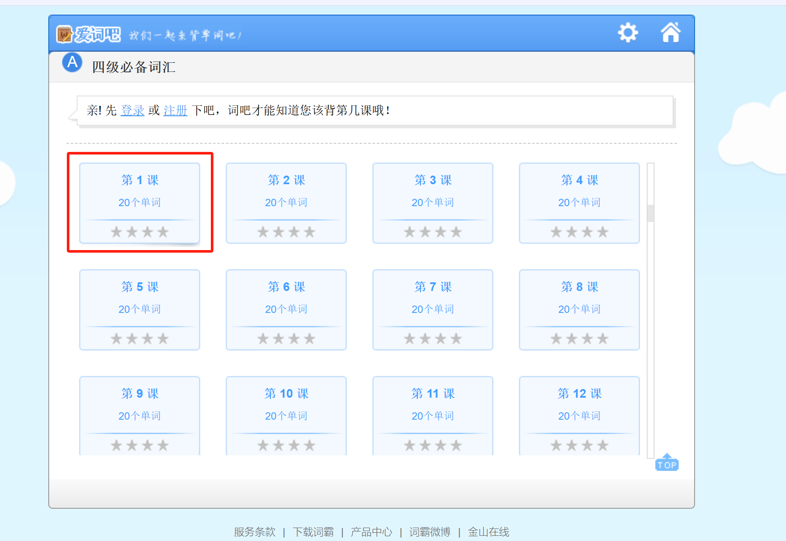
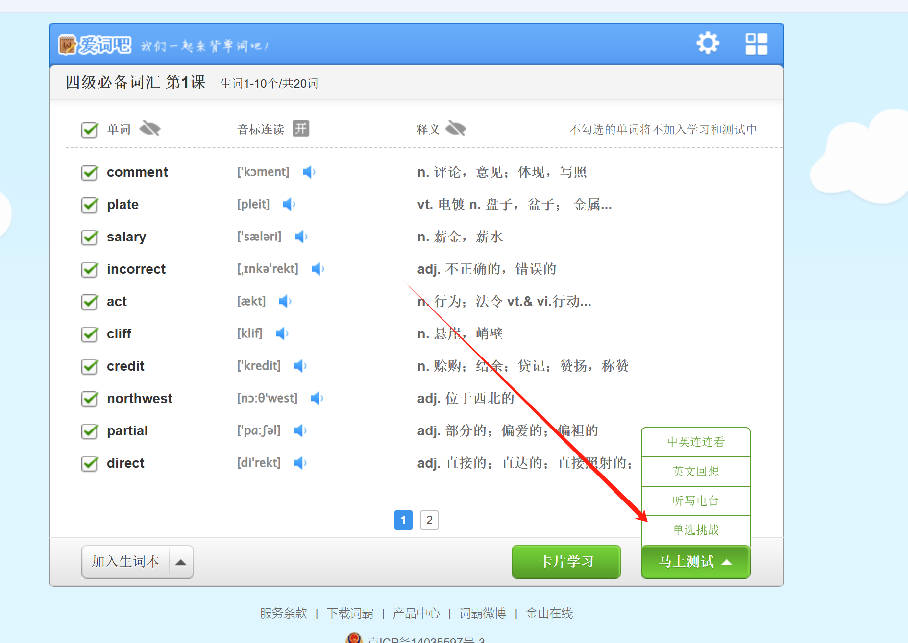

# 锥刺激型英単語暗記法の説明

# 遊び方説明：
英単語を暗記するとき、いつも眠くなってしまいます

そんな時は、少し刺激を与えて眠気を吹き飛ばしましょう

このデバイスを体に装着するだけで、あなたが単語を間違えたときに気合を入れてくれます〜

これで効率が飛躍的に向上します

# 使用前提条件
1. 自宅に2.4GHz Wi-Fiがあること
2. Wi-Fiとコンピュータが同じローカルネットワーク内にあること（同じルーターを使用）
3. ルーターがmDNSをサポートしていること（サポートしていない場合は携帯電話のホットスポットを使用）[ルーターがmDNSをサポートしているか確認（ほとんどのルーターはサポートしています）](../../other/检测路由器是否支持mdns（大部分路由器都支持）.md)
4. シンプルインテリジェントパルス（電気ショック）デバイスを所有していること：[シンプルインテリジェントパルス（電気ショック）デバイス](../../device/简单智能脉冲（电击）终端.md) または [淘宝リンク](https://item.taobao.com/item.htm?id=892309919507)

# 具体的な使用方法
関連ファイルのダウンロード：

藍奏云

[https://wwcg.lanzouu.com/ielL62nsy9cj](https://wwcg.lanzouu.com/ielL62nsy9cj)

パスワード:95pt

使用交流：[交流WeChatグループ](https://www.yuque.com/easysmart/easysmart/az9i4x3us4xu870f)

## ブラウザ拡張機能のインストール
1. Edgeブラウザを開く
2. アドレスバーに edge://extensions/ と入力してEnter

1. 開発者モードをオンにする

1. 解凍された拡張機能を読み込む

1. ステップ1フォルダ内のeasysmartフォルダを選択

1. インストール完了

1. その後はここで見つけることができます

## デバイスのネットワーク接続設定
（初回使用前はデバイスの充電をお勧めします）

1. スイッチをオンにしてデバイスを起動。起動後、デバイスのライトが点灯します
2. ミニアプリを起動してデバイスをネットワークに接続

このステップは[APPを使用してデバイスをWiFiに接続](../../other/设备连接wifi（配网）/通过APP将设备连接到wifi.md) または [ミニアプリを使用してデバイスをWiFiに接続](../../other/设备连接wifi（配网）/通过小程序将设备连接到wifi.md)を参照してください

## コンピュータでサーバーを起動
1. コンピュータでステップ2の起動.batを実行。実行後約2分で起動完了します（初回起動は時間がかかります）。赤枠の内容が表示されたら起動成功です（ファイルがない場合は文書先頭でダウンロードしてください）

1. 電極パッドを体に貼り、デバイスに接続できます

## 電圧 持続時間の設定
1. 拡張機能をクリックして開く

入ると以下のように表示されます

ローカルプログラムが起動を完了した場合、再接続をクリック

この時、下部にデバイスが表示されます

1. グローバル設定をクリックして電圧と遅延時間を設定

設定のテストをクリックするとパルス電圧が発せられます

**注意：20ボルトからテストを開始してください。各段階で数回テストし、刺激があまり感じられない場合に電圧を上げてください。一度に上げる量は10V以下がおすすめです。**

その後、設定を保存をクリック

## 英単語の暗記開始
扇貝単語はそのまま使用できます

ここでは詞霸単語を紹介します

ウェブサイトにアクセス

単語リストを1つ選択。例として4級を選びます

1レッスンを選択

単項チャレンジをクリック

この時、間違えると電気ショックが発動します