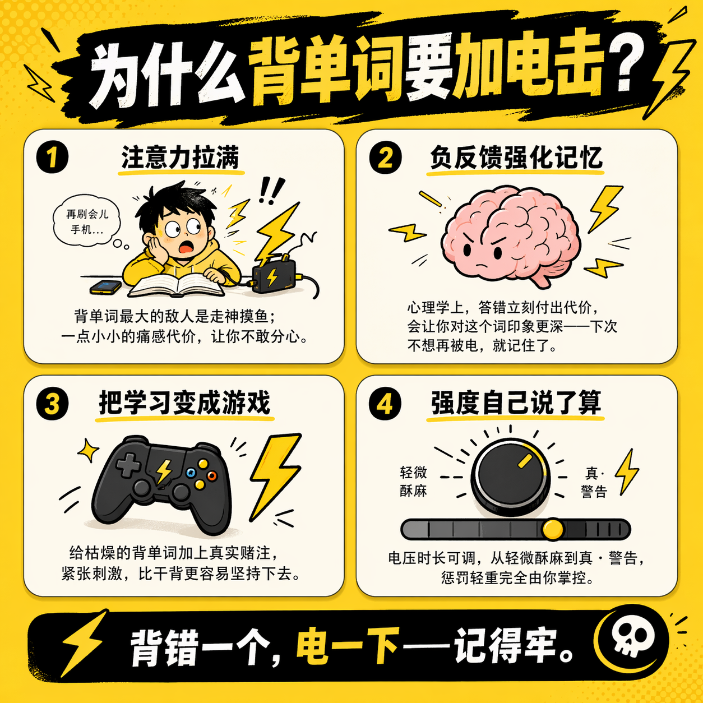
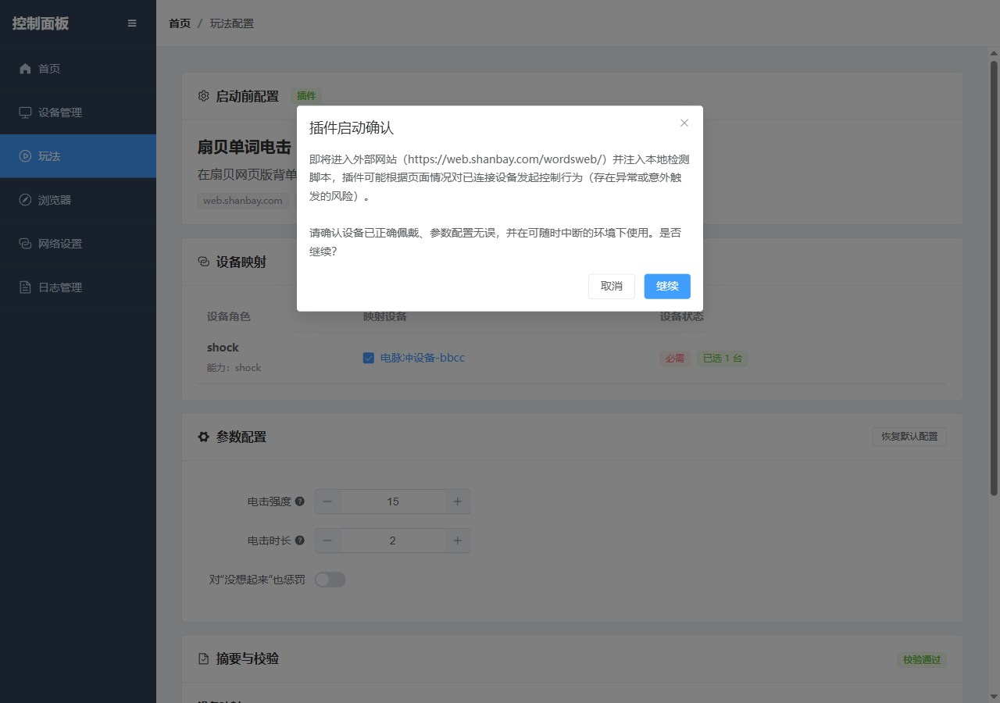

## なぜ『電撃』が必要なのか？

なぜゲームは学習よりも刺激的なのか？その理由は、負けることへの代償があるからです。負けたくない一心で、一歩一歩に全神経を集中し、その爽快感は天にも昇るほど。

ところで単語を覚えるときはどうでしょう？知っていれば「わかる」、知らなければ「わからない」。正解でも間違えても感情に波風は立ちません。脳のOSは「どっちでもいい、次」とつぶやき、単語はまったく頭に入ってきません 😭

しかし、**間違えたら『電気ショック』が一発ある**としたら？ミスに対して現実的な代償を与えることで、どの単語も一瞬で生死をかけた勝負に変わります。これが扇貝単語電気ショックプレイです：**間違える → 電撃 → 次は絶対に覚える** 🔌⚡

---

扇貝単語電気ショックは、扇貝のウェブ版単語学習ページをベースにしたプラグインのプレイスタイルです：プラグインがあなたが「わからない」（間違い）をクリックしたことを検知したとき、または罰則を有効にした状態で「思い出せない」と判断したときに、接続済みの電気ショックデバイスを作動させ、ズリ～ンと来るやつを届けます ⚡。

> 🛒 **デバイス入手方法**：[淘宝で購入](https://item.taobao.com/item.htm?id=1065205279302) | [公式サイトで購入](https://shop.undersilicon.cn/zh/products/beidanci) | [クーポン受け取り](../优惠券.md)  
> 🎬 **ビデオチュートリアル**：[硅基之下ビデオサイト(まだアップロードされていません)](https://video.undersilicon.com/w/pcesS2gYvbfuU5Wcf5v7fQ) | [YouTube(まだアップロードされていません)](https://youtu.be/Q7ti6oOdhpc)

<!-- TODO: ビデオチュートリアルは現時点で寸止めプレイ用のものを代用しています。扇貝単語電気ショック専用リンクに置き換えてください。 -->

## プレイ概要

全体の循環は一言で：**扇貝で解答 → プラグインが正誤を判断 → 間違えたら電気ショックデバイスを作動**。痛みによる記憶で、効率倍増です。

## 操作手順

### 1. 事前準備

まずクライアントをインストールし、デバイスを接続してください。詳細は [PC版制御クライアント](./client/PC版控制客户端.md) を参照してください。

起動前に以下の項目を再確認：

- 制御クライアントが電気ショックデバイスに接続されている（接続されていなければ電気ショックを浴びられません）
- デバイスマッピングに`shock`機能を持つデバイスが少なくとも1台以上登録されている
- ブラウザで扇貝ウェブ版単語学習ページが正常に開ける
- 初回使用時は、まず低強度・短時間で試してみて、最初から上限で挑戦しないこと ⚠️

### 2. プレイライブラリに入る

コントロールパネルのプレイライブラリから「扇貝単語電気ショック」を見つけます。

### 3. 起動前設定を開く

「設定して起動」をクリックし、プラグイン設定ページに入ります。

### 4. 電気ショックデバイスをマッピング

「デバイスマッピング」で`shock`機能を持つデバイスを1台選択します。なければまず1台接続しましょう 😉

### 5. パラメータを設定

必要に応じて以下のパラメータを調整：

- 電気ショック強度（低めから始め、徐々に上げていくことをお勧めします）
- 電気ショック時間（同様にまず短くしてから長くします）
- 「思い出せない」時も罰則を与えるか（強者向けオプション 💀）

### 6. プラグインを起動

「プラグイン起動」をクリックし、確認ポップアップで継続を選択。最後に後悔するチャンスです！

### 7. あなたの電気ショック学習の旅を始めましょう ⚡

学習ページはまず現在の単語、発音記号、2つの判断オプションを表示します。

正解後、結果状態に切り替わり、その単語は今日はもう学習しないことを通知。おめでとうございます、一難を逃れました 🎉

## シグナルルール

| 扇貝ページのシグナル | プラグインの判断 | デフォルトで電気ショック？ |
| --- | --- | --- |
| `認識` | 正解 | ❌ 電気ショックなし（良い子だ） |
| `不认识` | 不正解 | ⚡ 電気ショック！ |
| `想起来了` | 正解 | ❌ 電気ショックなし（思い出し成功） |
| `没想起来` | 思い出し失敗 | デフォルトは見逃し、罰則有効時は ⚡ |

## よくある質問 🛠️

- **電気ショックが作動しない**：デバイスマッピングで`shock`デバイスが選択されているか確認し、プラグイン設定ページでエラーが表示されていないことを確認。電気ショックがないのは良いことでは無いかも！
- **作動頻度が高すぎる**：「『思い出せない』時も罰則」をオフにするか、強度と時間を下げてください。自分にも優しくしましょうね 😅
- **ページが学習状態に入らない**：まず扇貝ウェブ版でアカウントがログイン済みで、単語学習が正常に開始できることを確認してください。

## 使用上の提案 💡

- まず電気ショックデバイスが正しくマッピングされていることを確認（電気ショック器があれば天下取れたも同然）
- 最初は低強度・短時間でテストし、自分に合った「痛みの閾値」を見つける
- ページを切り替えたりプラグインを終了する際は、まず現在の実行を停止する
- 単語を一組覚え終えると、自分に少しだけご褒美を。なぜなら……これまで続けられた人は皆、強者だから 💪⚡