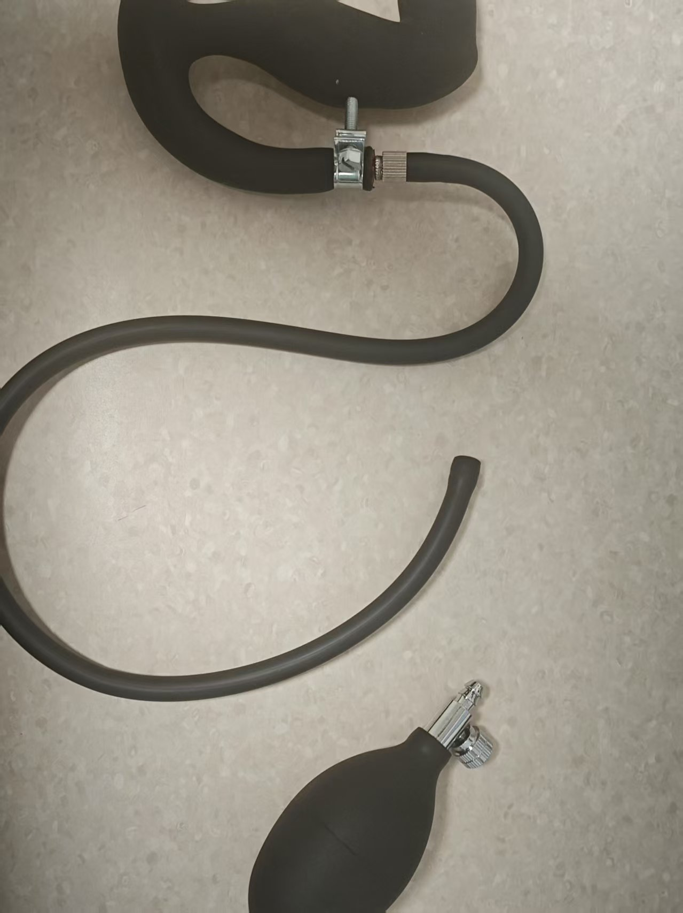
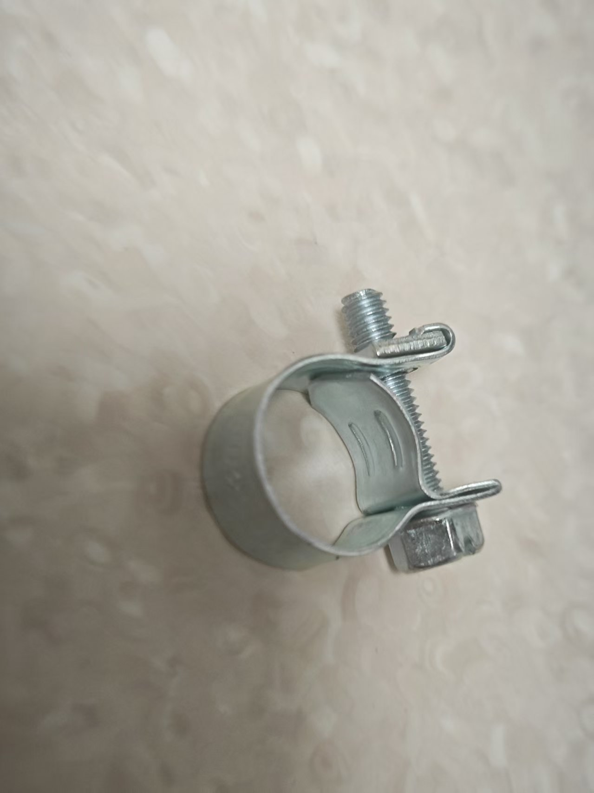

# 提肛訓練プレイ方法

# プレイ概要
+ 提肛訓練では「リラックスフェーズ」と「提肛フェーズ」を交互に行います
+ 目標は規定時間内にできるだけ多くの「提肛成功」を達成することです
+ 成功または失敗はインターフェースで直感的に表示され、失敗時は電気刺激が発生します（接続・有効化されている場合）

## ソフトウェアダウンロードと準備
Androidスマートフォン：[モバイルクライアント](/docs/player/new-phone-client)

Windows PC：[PC版コントロールクライアント](./client/PC版控制客户端.md)

# デバイスと準備
+ 必須デバイス：`気圧センサー（QIYA）`
+ オプションデバイス：`電気刺激デバイス（DIANJI）`、`自動ロック（ZIDONGSUO）`
+ 開始時に自動ロック、終了時に自動アンロック（自動ロックが接続されている場合）

## デバイス組み立て
インフレータブル肛門プラグの手動ポンプを取り外し、気圧センサーのチューブに接続します。肛門プラグのチューブを気圧センサーの三方継手に接続すれば完了です～

1. 肛門プラグ受け取り時の状態（新型肛門プラグは形状が変更され、密封性能が向上しています。以下と類似しています）

2. 手動ポンプの取り外し

3. 気圧センサーの両端への接続

4. 完成状態

5. 気圧漏れが早いと感じる場合は、オプションで補強可能

このクランプを接続部で締め上げると、気圧漏れの速度を抑えられます

クランプ購入アドレス：[https://item.taobao.com/item.htm?id=724827233726](https://item.taobao.com/item.htm?id=724827233726) （11-13mm

## ゲームエントリー

# パラメータ説明
+ `持続時間(分)`：ゲーム全体の長さ
+ `提肛回数目標`：達成を目指す成功回数。全体の進捗表示に使用されます
+ `気圧変化度(kPa)`：提肛フェーズで達成すべき気圧増加しきい値（リラックスフェーズの最低気圧を基準）
+ `電気刺激強度(V)`：失敗時の電気刺激の強さ
+ `電気刺激持続時間(秒)`：失敗時の電気刺激の持続時間
+ `単一サイクル時間(秒)`：各フェーズの長さ。デフォルトは10秒（リラックス10秒 → 提肛10秒 → 繰り返し）

# プレイフロー
+ リラックスフェーズ
    - 力を抜き自然な呼吸をします。システムはこのフェーズの「最低気圧」を参考値として記録します
    - カウントダウン終了後、提肛フェーズに移行します
+ 提肛フェーズ
    - このフェーズの時間内に、気圧を「最低気圧 + 気圧変化度」まで上げる必要があります
    - 目標に到達すると「達成済み」と判定されますが、フェーズのカウントダウンが終了するまで次のラウンドには進みません
    - フェーズ終了までに目標未達の場合、「挑戦失敗 · 電気刺激開始」と判定されます（電気刺激デバイスが利用可能な場合）
+ フェーズ交代
    - 各ラウンドは「リラックス → 提肛 → リラックス → …」のサイクルで繰り返され、時間終了または目標回数達成まで続きます

# インターフェース表示
+ 上部の大きな文字で現在のフェーズ（リラックスフェーズ/提肛フェーズ）とフェーズの残り時間を表示
+ 全体の進捗
    - 回数ベースのプログレスバー：完了回数 / 目標回数
    - 時間ベースのプログレスバー：経過時間 / 総時間
+ 圧力と目標
    - 現在の圧力（kPa）
    - リラックスフェーズ最低圧力（参考値）
    - 提肛目標圧力（最低圧力 + 気圧変化度）
+ 成功/失敗表示
    - 成功：数字の後に緑色のカプセル「達成済み」を表示
    - 失敗：数字の後に赤色のカプセル「挑戦失敗 · 電気刺激開始」を表示
+ 操作とログ
    - ボタン：一時停止、手動電気刺激
    - ログ：最近の情報とシステムメッセージを表示

**終了と統計**

+ 設定された持続時間に到達、または成功回数が目標に達すると終了します
+ 終了後は自動アンロックされます（自動ロックが接続されている場合）
+ インターフェースに累計成功回数と電気刺激回数などが表示されます

**利用推奨事項**

+ 初回利用時は「気圧変化度」を低めに設定し、リズムに慣れることをお勧めします
+ 電気刺激デバイスを接続する場合は、低強度から始め徐々に調整してください
+ 呼吸は安定させ、提肛フェーズでは目標達成に集中して圧力を上げてください

**クイックスタート**

+ 気圧センサーを接続（電気刺激デバイス、自動ロックはオプション）
+ パラメータを設定して開始
+ リラックスフェーズでは力を入れず、カウントダウンを待機；提肛フェーズでは目標まで力を入れて圧力を上げる
+ 「達成済み」が表示されたら、本フェーズ終了までその状態を維持；失敗時は表示と電気刺激が発生
+ 終了まで繰り返し、統計とプログレスバーで完了状況を確認