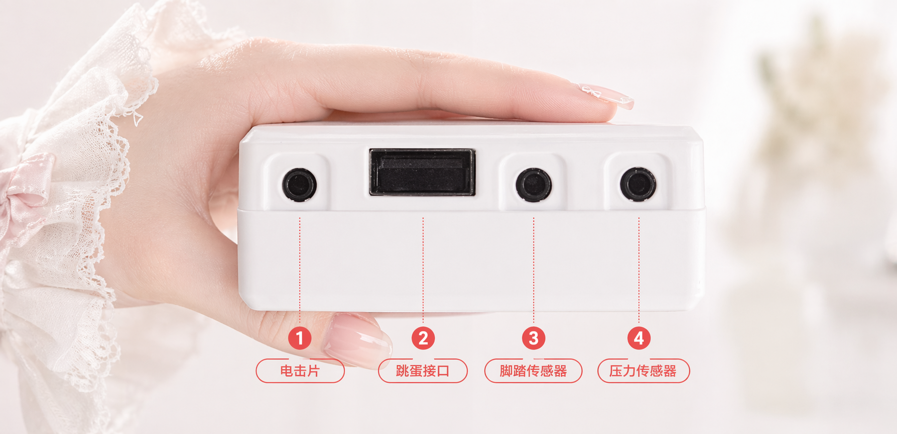

爪先立ちと骨盤底筋を同時に行うことは、効果的な姿勢トレーニング方法であり、骨盤底筋群とふくらはぎの筋肉を強化するのに役立ちます。このチュートリアルでは、インテリジェントトレーニングデバイスを使用して、爪先立ち・骨盤底筋トレーニングを行う方法を説明します。

> 🛒 **デバイスの入手**：[淘宝で購入](https://item.taobao.com/item.htm?id=1044468799434)
> 🎬 **ビデオチュートリアル**：[シリコンバレー動画サイト](https://video.undersilicon.com/w/pcesS2gYvbfuU5Wcf5v7fQ) | [YouTube](https://youtu.be/Q7ti6oOdhpc)

## 事前準備

1.  **クライアントの接続**: まずはアプリをインストールし、ホストデバイスに接続してください。詳細は [クライアントのダウンロードとデバイス接続](new-phone-client.md) をご確認ください。
2.  **デバイスの装着**:
    -   **骨盤底筋センサー**: 潤滑剤を使用し、横向きに寝てリラックスした状態でゆっくりと挿入してください。徐々に慣らしていき、無理をしないように注意してください。
    -   **電極パッド**: 太ももに貼り付け（左右1枚ずつ）、トレーニングフィードバック刺激を提供します。
    -   **爪先立ちセンサー**: 靴下や靴の中に入れ、かかとに密着させます。
    -   **ホストデバイス**: 太ももにストラップで固定し、上記すべてのアクセサリのケーブルをホストに接続します。接続方法は以下の図を参照してください:

    

## トレーニング開始

1.  **デバイスの選択**: アプリ内で接続済みのデバイスをタップします。
2.  **トレーニングモードの選択**: モードを「**爪先立ち・骨盤底筋**」に設定します。
3.  **パラメータの設定**: 適切なフィードバック強度（EMS電気刺激パラメータ）を設定します。
4.  **体験開始**: 開始をタップし、トレーニング状態に入ります。

## トレーニングルール

デバイスはあなたの身体動作をリアルタイムで検出します。トレーニング中は:
-   **骨盤底筋を持続的に収縮させた状態を維持**する必要があります。
-   **かかとを浮かせた（床から離した）状態を維持**する必要があります。

動作が不十分と検出された場合、デバイスは電気刺激によって通知し、姿勢を再調整するためのサポートをします。トレーニング継続により、徐々に体幹の制御力を向上させましょう。

### 注意事項

1.  センサーは完全防水ではありません。水中で洗浄しないでください。使い捨てプロテクターカバーで包むことができます。清掃時はカバーを取り替え、センサー本体は拭くだけで十分です。
2.  清掃後、センサーは密封袋に入れて保管してください。長時間乾燥した環境に置くと表面がひび割れる原因となります。
3.  心臓、頭部、体幹などの重要な部位では電気刺激機能を使用しないでください。また、電流がこれらの部位を流れるような使用も禁止です。人体使用時の電圧は36Vを超えてはなりません。体調不良時や、その他の基礎疾患がある場合は、本製品の使用を禁止します。