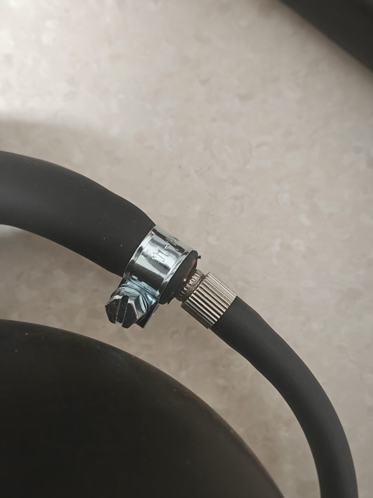

# 肛門収縮トレーニングプレイ方法

# プレイ概要
+ 肛門収縮トレーニングは「弛緩フェーズ」と「収縮フェーズ」を交互に行います
+ 目標は規定時間内にできるだけ多くの「収縮成功」を完了することです
+ 成功または失敗はインターフェースで直感的に表示され、失敗時は電気刺激が発生します（接続・有効化されている場合）

## ソフトウェアのダウンロードと準備
Androidスマートフォン：[スマートフォンクライアント（デフォルトWiFiを使用することを推奨、ネットワーク設定を行わない）](../手机客户端（建议采用默认wifi，不要进行配网）.md)

Windowsコンピュータ：[新版コンピュータクライアント使用ガイド](../（电脑版）控制客户端/新版电脑客户端使用指南.md)

# デバイスと準備
+ 必須デバイス：`気圧センサー（QIYA）`
+ オプションデバイス：`電気刺激デバイス（DIANJI）`、`自動ロック（ZIDONGSUO）`
+ 開始時に自動ロック、終了時に自動アンロック（自動ロックが接続されている場合）

## デバイスの組み立て
膨張式肛門プラグの空気入れボールを外し、気圧センサーのホースに接続します。肛門プラグのホースは気圧センサーの三方弁に接続します。

1. 肛門プラグの到着時の状態（新型プラグは形状が異なり、シール性能が向上しています。以下の画像と類似しています）

2. 空気入れボールの取り外し

3. 気圧センサーの両端への接続

4. 完成品の状態

5. 気圧漏れが速いと感じる場合、オプションの強化方法

このクランプを接続部にしっかり締め付けることで、気圧漏れ速度を低減できます。

クランプ購入先：[https://item.taobao.com/item.htm?id=724827233726](https://item.taobao.com/item.htm?id=724827233726) （11-13mm）

## ゲームエントリー

# パラメータ説明
+ `持続時間(分)`：ゲーム全体の所要時間
+ `収縮目標回数`：完了を期待する成功回数。総進捗表示に使用します
+ `気圧変化度(kPa)`：収縮フェーズで達成する必要がある気圧増分のしきい値（弛緩フェーズの最低気圧に対して）
+ `電気刺激強度(V)`：失敗時の電気刺激強度
+ `電気刺激持続時間(秒)`：失敗時の電気刺激持続時間
+ `1サイクル時間(秒)`：各フェーズの時間。デフォルトは10秒（弛緩10秒 → 収縮10秒 → 繰り返し）

# プレイフロー
+ 弛緩フェーズ
    - 力を抜き、自然に呼吸します。システムはこのフェーズの「最低気圧」を基準値として記録します
    - カウントダウン終了後、収縮フェーズに移行します
+ 収縮フェーズ
    - このフェーズの時間内に、気圧を「最低気圧 + 気圧変化度」まで上昇させる必要があります
    - 目標に到達すると「達成済み」と判定されますが、このフェーズのカウントダウンが終了するまで待ち、次のラウンドに進みます
    - フェーズ終了前までに目標に到達しなかった場合、「チャレンジ失敗・電気刺激開始」と判定されます（電気刺激デバイスが利用可能な場合）
+ フェーズ交代
    - 各ラウンドは「弛緩 → 収縮 → 弛緩 → …」のサイクルで繰り返され、時間が終了するか目標回数に達するまで続きます

# インターフェース表示
+ 上部に大きな文字で現在のフェーズ（弛緩フェーズ/収縮フェーズ）とこのフェーズの残り時間が表示されます
+ 全体の進捗
    - 回数ベースのプログレスバー：完了回数 / 目標回数
    - 時間ベースのプログレスバー：経過時間 / 総時間
+ 気圧と目標
    - 現在の気圧 (kPa)
    - 弛緩期最低気圧（参考値）
    - 収縮目標気圧（最低気圧 + 気圧変化度）
+ 成功/失敗表示
    - 成功：数値の後に緑色のカプセル「達成済み」が表示されます
    - 失敗：数値の後に赤色のカプセル「チャレンジ失敗・電気刺激開始」が表示されます
+ 操作とログ
    - ボタン：一時停止、手動電気刺激
    - ログ：最近の情報とシステムメッセージを表示します

**終了と統計**

+ 設定された持続時間に到達するか、成功回数が目標に達すると終了します
+ 終了後は自動的にアンロックされます（自動ロックが接続されている場合）
+ インターフェースに累計成功回数と電気刺激回数などが表示されます

**使用上のアドバイス**

+ 初めて使用する場合は、「気圧変化度」を低く設定し、リズムに慣れることをお勧めします
+ 電気刺激デバイスを接続している場合は、低い強度から始め、徐々に調整してください
+ 呼吸を穏やかに保ち、収縮フェーズでは気圧を目標まで上げることに集中してください

**クイックスタート**

+ 気圧センサーを接続します（電気刺激デバイス、自動ロックはオプションで接続）
+ パラメータを設定し、開始します
+ 弛緩フェーズでは力を入れず、カウントダウンを待ちます。収縮フェーズでは力を入れて目標まで上げます
+ 「達成済み」が表示されたら、このフェーズが終わるまで維持します。失敗の場合は表示され、電気刺激が発生します
+ 終了までサイクルを繰り返し、統計とプログレスバーで完了状況を確認します