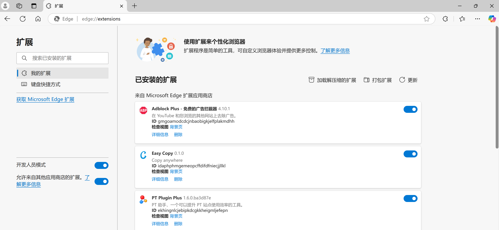
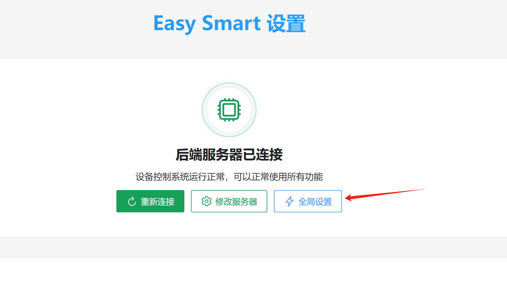

# 刺激脳活性化単語暗記法 説明書

# 遊び方説明：
単語を覚えるとき、どうしても眠くなってしまう

そんな時は少しの刺激で眠気を吹き飛ばそう

このデバイスを体に装着すれば、単語を間違えたときに気合を入れ直すことができます～

これで効率が飛躍的に向上します

# 使用前提
1. 自宅に2.4Gwifiがあること
2. wifiとPCが同じLAN（同じルーター）であること
3. ルーターがmdnsをサポートしていること（未対応の場合は携帯電話のホットスポットを使用）[ルーターがmdnsをサポートしているか確認する（大部分のルーターは対応）](../其他使用说明/检测路由器是否支持mdns（大部分路由器都支持）.md)
4. 簡易スマートパルス端末を用意：[簡易スマートパルス（電気刺激）端末](../设备介绍&购买/简单智能脉冲（电击）终端.md) または [淘宝リンク](https://item.taobao.com/item.htm?id=892309919507)

# 具体的な使用方法
関連ファイルのダウンロード：

藍奏雲

[https://wwcg.lanzouu.com/ielL62nsy9cj](https://wwcg.lanzouu.com/ielL62nsy9cj)

パスワード:95pt

使用方法の交流：[交流WeChatグループ](https://www.yuque.com/easysmart/easysmart/az9i4x3us4xu870f)

## ブラウザ拡張機能のインストール
1. Edgeブラウザを開く
2. アドレスバーに edge://extensions/ と入力しEnterキーを押す

1. 開発者モードをオンにする

1. 解凍した拡張機能を読み込む

1. 手順1のフォルダの中のeasysmartフォルダを選択する

1. インストール完了

1. その後はここで見つけられる

## デバイスのネットワーク設定
（初回使用前はデバイスの充電を推奨）

1. スイッチを切り替えてデバイスを起動する 起動後デバイスはライトが点灯する
2. ミニアプリを起動してデバイスをネットワークに接続する

この手順については、[アプリ経由でデバイスをWiFiに接続する](../其他使用说明/设备连接wifi（配网）/通过APP将设备连接到wifi.md) または [ミニアプリ経由でデバイスをWiFiに接続する](../其他使用说明/设备连接wifi（配网）/通过小程序将设备连接到wifi.md) を参照してください

## PC上でサーバーを実行する
1. PCで手順2の起動.batを実行する 実行後約2分で起動完了（初回実行は時間がかかる） 赤枠の内容が表示されれば起動成功（該当ファイルがない場合は文書冒頭からダウンロード）

1. 電極パッドを身体に装着し、デバイスに接続できる

## 電圧 持続時間の設定
1. 拡張機能をクリックして開く

入ると図のように表示される

ローカルプログラムの起動が完了していれば「再接続」をクリック

この時、下にデバイスが表示される

1. 「グローバル設定」をクリックし、電圧と遅延時間を設定する

「設定をテスト」をクリックすると、パルス電圧が発生する

**注意：20ボルトからテストを始めてください。各段階で数回テストし、どれも刺激が弱い場合は電圧を上げてください。一度の増加は10V以下を推奨します。**

その後、「設定を保存」をクリック

## 単語暗記を始める
シャンベイ単語はそのまま使えばOK

ここでは詞覇単語を紹介します

サイトにアクセスする

単語リストを一つ選ぶ 例として四級

レッスンを一つ選ぶ

「選択問題チャレンジ」をクリック

この時、選択を間違えると電気刺激が発動する